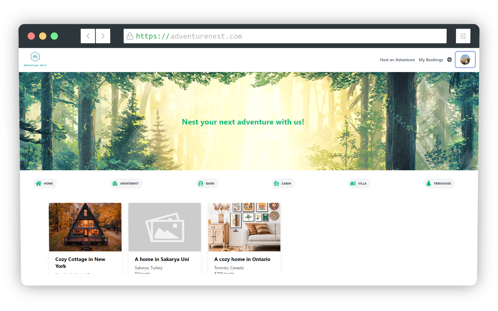

# Adventure Nest


## 📖 Table of Contents
- [Adventure Nest](#adventure-nest)
  - [📖 Table of Contents](#-table-of-contents)
  - [📝 About](#-about)
  - [💻 Working](#-working)
  - [⚙️ Tech Stack](#️-tech-stack)
  - [🔍 Features](#-features)
  - [🔨 Installation](#-installation)
  - [🤖 Weights and AI Model](#-weights-and-ai-model)
  - [📜 License](#-license)
  - [🔮 Future Plans](#-future-plans)


## 📝 About
AdventureNest is a web-based application designed to simplify the process of renting properties. It offers an intuitive platform for property owners to list their homes, upload photographs, and automate the object detection process for efficient property management. 

Additionally, when renting out their homes once a home owner uploads a photograph of their property, the application utilizes a deep learning module which automatically detects objects within the photograph and provides a list of items that the home owner contains within their home. 

## 💻 Working
A showcase video of the project can be found [here](https://www.youtube.com/watch?v=drfX8U5p4lE&t=6s&ab_channel=WaasiqMasood).

## ⚙️ Tech Stack
AdventureNest utilizes the following technologies:

1. Frontend:
- [React](https://reactjs.org/)
- [TypeScript](https://www.typescriptlang.org/)
2. Backend:
- [ASP.NET Core](https://docs.microsoft.com/en-us/aspnet/core/?view=aspnetcore-5.0)
- [Flask](https://flask.palletsprojects.com/en/1.1.x/)
3. AI: 
- [PyTorch](https://pytorch.org/)
- [YOLOv5](https://github.com/ultralytics/yolov5)

## 🔍 Features
AdventureNest provides the following features:
1. Property Listing: Property owners can list their homes for rental purposes, providing essential information about the property.
2. Photo Upload: Users can upload photographs of their property through an intuitive interface.
3. Object Detection: The backend integrates the YOLO algorithm to automatically detect objects within the uploaded property photos.
4. User-Friendly Interface: AdventureNest offers a seamless and user-friendly interface, making it accessible to property owners without specialized information technology skills.
5. Google Authentication: AdventureNest utilizes Google Authentication to ensure the security of user accounts.

## 🔨 Installation
See frontend and backend installation folders for individual installation instructions.

1. Clone the repository
```bash
git clone
```
2. Install dependencies on the frontend
```bash
npm install
```
3. Install dependencies on the flask backend
```bash
pip install -r requirements.txt
```
4. Install dependencies on the ASP.NET backend
```bash
dotnet restore
```
5. Run the frontend
```bash
npm start
```
6. Run the flask backend
```bash
python app.py
```
7. Run the ASP.NET backend
```bash
dotnet run
```

## 🤖 Weights and AI Model
The weights for the YOLOv5L model can be found [here](https://drive.google.com/file/d/1SuCylSi7Zs83C8gEAiD-lbZurQZk6Ejj/view). Make sure to change the path of the weight
file in detect.py in the backend/flask folder.

## 📜 License
[](https://opensource.org/licenses/MIT)

## 🔮 Future Plans
- [ ] Implement recommendation system and improve UI.
- [ ] Responsive design for mobile devices.
- [ ] Implement a payment system.
- [ ] Implement review system.
- [ ] Implement backend in Node.js for fun (Backend is currently implemented in ASP.NET core due to limitations of tech stack by the university).
- [ ] Host the website on a cloud platform.
- [ ] Implement a chat system.
- [ ] Implement a notification system.
- [ ] Implement CDN for image storage.


